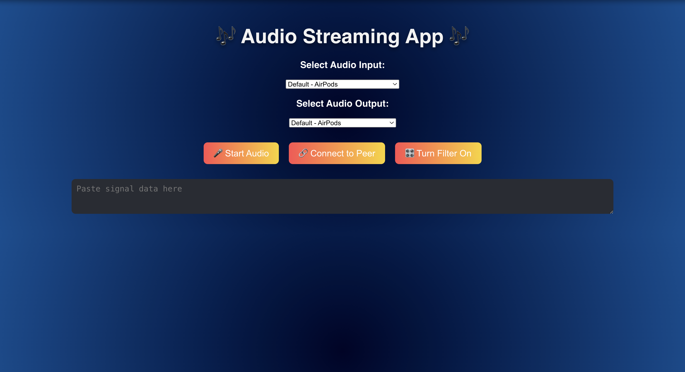

# Getting Started with Create React App

This project was bootstrapped with [Create React App](https://github.com/facebook/create-react-app).

# Setup Project on local
- clone project using 'git clone https://github.com/Sunil0124/audio-webrtc-react.git'
- cd audio-webrtc-react
- npm install
- npm start

## Available Scripts

In the project directory, you can run:

### `npm start`

Runs the app in the development mode.\
Open [http://localhost:3000](http://localhost:3000) to view it in your browser.

The page will reload when you make changes.\
You may also see any lint errors in the console.

# `Audio Streaming Application`

### `Project Overview`

I developed an audio streaming application that enables two users to stream audio in real time using WebRTC. The app not only allows users to manipulate the audio but also visualizes it, making interactive experience.
 
### `Tools and Technologies:`
 - Node.js (v17 and above)
 - IDE (VS Code similar)
 - Git
 - npm (package manager)
 - React: For building the UI components.
 - CSS: To style the application beautifully.

    ### Dependencies
    - React JS
    - SimplePeer: To handle the WebRTC connections smoothly.

### `Steps`:
 
1. Setting Up: I started with Creating React App to kick things off quickly and set a solid foundation.
 
2. WebRTC Integration: I used SimplePeer to manage peer-to-peer connections, allowing users to connect and stream audio seamlessly.
 
3. Audio Processing: Utilized the Web Audio API, I set up audio capturing and processing, including filters for an enhanced sound experience.
 
4. User Interface: Designed a clean and responsive interface with buttons for starting streams, toggling filters, and selecting audio inputs.
 
5. Visualization: Implemented a canvas-based waveform visualizer that updates in real time as the audio plays.
 
### `Challenges Encountered`
 
- WebRTC Connection Issues: It was my first time working with WebRTC and faced some challenges to establishing stable connections between peers, which took some time to debug.
 
- Web Audio API: Getting the hang of the Web Audio API was a bit challenging at first, especially with setting up the audio context and processing nodes.

- Had to research on using setSinkId to get the output devices connected to device and  accesible form browser

- Design: Ensuring that the UI worked well across different browsers involved quite a bit of testing and adjustments.
 
 
### `Code Quality`
 
- Modular Code: I organized the code into reusable components, which makes it easier to manage and understand.
 
- Clean Practices: I followed best practices for naming and structuring the code to keep things tidy and maintainable.

### `Optionally - npm run build`

Builds the app for production to the `build` folder.\
It correctly bundles React in production mode and optimizes the build for the best performance.

The build is minified and the filenames include the hashes.\
Your app is ready to be deployed!

See the section about [deployment](https://facebook.github.io/create-react-app/docs/deployment) for more information.